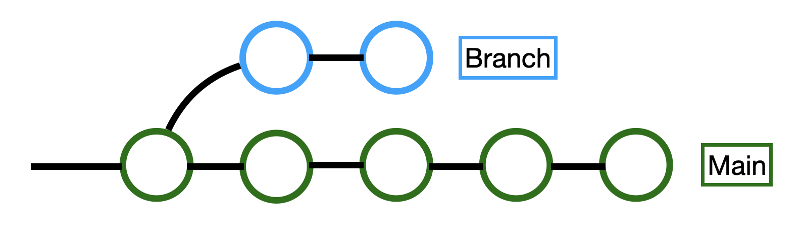

#### 1. Git Konfiguration
Mit dem Befehl `git config` können Sie die Konfiguration zwischen Ihrem Computer und Ihrem GitHub-Konto einrichten. Dazu können Sie folgendes Beispiel verwenden:

     git config --global user.name "[Name]"
     git config --global user.email "[E-Mail-Adresse]"

     git config --global --list

Überprüfung der Konfiguration
        
---

### 2. Repository Initialisieren

Mit dem Befehl git init können Sie eine Datei auf Ihrem Computer im Git-System bekannt machen. Dazu können Sie folgendes Beispiel verwenden:

     git init

 In einem Ordner git initialisieren
 
     git init [Repository-Name]

----
### 3. Repository clonen

Mit dem Befehl git clone können Sie ein Repository von Ihrem Konto auf Ihren Computer kopieren und ein Klon erstellen. Dazu können Sie folgendes Beispiel verwenden:

### git clone Verwendung

Der Befehl git clone wird verwendet, um eine Kopie eines Git-Repositories (Depot) auf Ihren lokalen Rechner zu erhalten. Dieser Befehl kopiert ein entferntes Repository (in der Regel auf einem Server oder einer Plattform wie GitHub) in ein lokales Verzeichnis.

### Grundlegende Verwendung

      git clone [repository-URL]

### Beispiele:

### Einfache Verwendung:
 
      git clone https://github.com/nutzer/projektname.git

Dieser Befehl kopiert das Git-Repository von der angegebenen URL auf Ihren lokalen Rechner. Die kopierten Dateien werden in einem neuen Ordner im Verzeichnis erstellt, in dem Sie den Befehl ausgeführt haben.

### In ein bestimmtes Verzeichnis klonen:

      git clone https://github.com/nutzer/projektname.git neuer_ordner

Dieser Befehl kopiert das Repository in einen Ordner mit dem Namen neuer_ordner. Wenn dieser Ordner nicht existiert, wird er automatisch erstellt.

Bestimmten Branch klonen: Wenn Sie nur einen bestimmten Branch klonen möchten, können Sie die Option --branch (oder -b) verwenden.

      git clone --branch branch_name https://github.com/nutzer/projektname.git

### Dieser Befehl klont den angegebenen Branch.

### Nutzungsszenarien

Projektbeginn: Wenn Sie einem Projekt beitreten möchten, können Sie das Projekt-Repository klonen, um Zugriff auf alle Dateien zu erhalten.

Zusammenarbeit: Bei der Zusammenarbeit mit Teamkollegen können Sie die Kopie des Repositories verwenden, um die Änderungen anderer zu sehen und beizutragen.

### Wichtige Hinweise

Zugriffsrechte: Wenn Sie ein privates Repository klonen, müssen Sie über die entsprechenden Zugriffsrechte verfügen. Dies erfordert in der Regel einen Benutzernamen und ein Passwort oder einen SSH-Schlüssel.
   
Internetverbindung: Für den git clone-Befehl ist eine Internetverbindung erforderlich. Je nach Größe des Repositories kann dieser Vorgang einige Zeit in Anspruch nehmen.

### Zusammenfassung

git clone ist ein grundlegender Befehl, um eine lokale Kopie eines entfernten Git-Repositories zu erhalten. Dieser Befehl ist entscheidend für die Mitarbeit an Projekten und die Zusammenarbeit. 

---

### 4. Datei Hinzufügen

Mit dem Befehl git add können Sie eine Datei zu Ihrem aktuellen Repository hinzufügen. Dazu können Sie folgendes Beispiel verwenden:

     git add [Dateiname]

     git add "file name"  z.b. git add index.html

bestimmte Dateien zur Versionskontrolle hinzufügen
                
     git add .

  Alles was untracked ist, zur Versionskontrolle hinzufügen  

---

### 5. Änderungen Speichern

Mit dem Befehl git commit können Sie Änderungen dauerhaft speichern und sicherstellen, dass Ihre Teamkollegen darüber informiert werden. Dazu können Sie folgendes Beispiel verwenden:

     git commit -m "[Ihr Commit-Nachricht]"

     git commit -m "meine Nachricht"

"Sie schreiben Ihre Änderungen als Kommentar, damit ersichtlich ist, welche Änderungen Sie vorgenommen haben."

---     

### 6. Branches Auflisten

Mit dem Befehl git branch, einem der wichtigsten Befehle, können Sie alle erstellten Branches auflisten. Um einen neuen Branch zu erstellen, sollten Sie den folgenden Befehl ausführen:

     git branch [Branch-Name]

     git checkout -b branchName    

Wir erstellen eine Branch (eine unabhängige Kopie des Hauptprojektes)
Dieser Befehl erstellt die Branch (engl. für Abzweigung) und wechselt auf diese Branch    

---

---

### 7. Branch Zusammenführen

Mit dem Befehl git merge können Sie einen erstellten Branch einfach mit der Hauptdatei zusammenführen. Dazu können Sie folgendes Beispiel verwenden:

      git merge [Branch-Name]

Auf einen existierenden Branch (engl. für Abzweigung) wechseln, können wir mit 

      git checkout branchName

---

      git checkout master
      git merge feature-branch

Dieser Befehl integriert die Änderungen aus dem Branch feature-branch in den master-Branch.

---

### 8. git version

Es zeigt Ihnen die Git-Version.

      git --version

---

### 9. git Ordnerkontrolle

      ls -la

Versteckte Dateien/ Ordner im repository anzeigen, wenn wir den Ordner .git sehen, ist es die Bestätigung das git (Versionskontrolle) im Repo initialisiert wurde  

---

### 10. git push

Erläuterung: Sendet Ihre Änderungen im lokalen Repository an ein entferntes Repository. Dieser Befehl wird häufig verwendet, um Aktualisierungen im Projekt zu teilen.

### Verwendung:

      git push [remote-repo-name] [branch-name]

### Beispiel:

      git push origin master

Dieser Befehl sendet die Änderungen im lokalen master-Branch an das entfernte Repository mit dem Namen origin.

---

### 11. git pull

Erläuterung: Holt Änderungen von einem entfernten Repository und integriert sie in Ihr lokales Repository. Es kombiniert die Befehle git fetch und git merge.

### Verwendung:

      git pull [remote-repo-name] [branch-name]

### Beispiel:

      git pull origin master

Dieser Befehl holt die Änderungen aus dem master-Branch des entfernten Repositories origin und integriert sie in Ihren lokalen master-Branch.

---

### 12. origin

Erläuterung: Der Standardname für das entfernte Repository. Dieser Name wird normalerweise automatisch vergeben, wenn Sie ein Repository klonen oder hinzufügen. origin steht für das Haupt-Remote-Repository.

---

### 13. master

Erläuterung: Der Standardname für den Haupt-Branch in Git-Projekten. Er wird häufig als Basis für Entwicklung und Deployment verwendet. In einigen Projekten kann dieser Branch auch main genannt werden.

--- 

### 14. git status

Erläuterung: Zeigt den aktuellen Status Ihres lokalen Repositories an. Es informiert darüber, welche Dateien geändert wurden, welche Dateien zum Staging hinzugefügt wurden und welche Dateien nicht verfolgt werden (untracked).

### Verwendung:

      git status

### Beispiel:

      git status

Dieser Befehl zeigt den aktuellen Branch, Ihre Änderungen und nicht verfolgte Dateien an.

--- 

### 15. git log

Erläuterung: Wird verwendet, um die Historie Ihres Git-Repositories anzuzeigen. Es zeigt eine detaillierte Liste aller durchgeführten Commits an.

### Verwendung:

      git log

### Beispiel:

      git log

Dieser Befehl zeigt die Commit-Historie an. Für eine kürzere Zusammenfassung können Sie die Option --oneline hinzufügen:

      git log --oneline

---

### 16. git fetch

Erläuterung: Holt Änderungen von einem entfernten Repository in Ihr lokales Repository, integriert diese jedoch nicht automatisch. Sie können die Änderungen lokal überprüfen.

### Verwendung:

      git fetch [remote-repo-name]

### Beispiel:

      git fetch origin

Dieser Befehl holt alle Änderungen aus dem entfernten Repository origin in Ihr lokales Repository, integriert sie jedoch nicht.

### Zusammenfassung

git push: Sendet lokale Änderungen an ein entferntes Repository.

git pull: Holt Änderungen aus einem entfernten Repository und integriert sie in Ihr lokales Repository.

origin: Der Standardname für das entfernte Repository.

master: Der Standardname für den Haupt-Branch.

git status: Zeigt den Status Ihres lokalen Repositories an.

git log: Zeigt die Commit-Historie an.

git merge: Führt zwei Branches zusammen.

git fetch: Holt Änderungen von einem entfernten Repository, integriert sie jedoch nicht.

